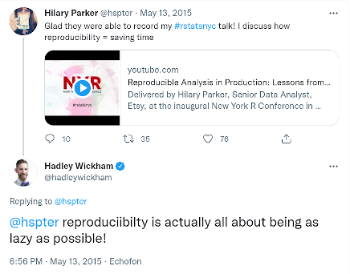

layout: true


```{r child = "content/config/sessions_setup.Rmd"}
```
---

## Computer literacy live demo


.center[]

<div>(Icons made by <a href="https://www.flaticon.com/authors/freepik" title="Freepik">Freepik</a> from <a href="https://www.flaticon.com/" title="Flaticon">www.flaticon.com</a>)</div>

---


class: center, middle

# Overview


---

## Computer literacy as a barrier to reproducibility

- There exists multiple barriers to reproducibility
- In "The Turing Way", some of these [Barriers to reproducibility](https://the-turing-way.netlify.app/reproducible-research/overview/overview-barriers.html#barriers-to-reproducibility) are introduced
- Among them: 
    - Big data and complex computational infrastructure
    - Takes time
    - Requires additional skills

---


## Overall objective

- Introduce concepts and software tools 
- Provide necessary skills for subsequent modules
- Topics that will be covered:
    - Be lazy, but trustworthy!
    - Organization of a research project on a computer (file/folder structure, naming conventions, etc.)
    - Working with files and folders (file system, absolute and relative paths, working directory)
    - Using a command-line interface (CLI)
    - The beauty of plain text

---


## Disclaimer

- Targets MS Windows user
- Your mileage may vary...

---


## Two guiding principles of reproducibility

> Be trustworthy!

> Be lazy!

---


## Be lazy!



(Source: https://twitter.com/hadleywickham/status/598532170160873472)

---


## Some derived principles of being a trustworthy researcher

> Be trustworthy!

1. Document everything and be transparent in your research!
2. Share all materials (if possible)!
3. Ideally, also document and share workflows (→ automation)
4. ....


---


## Some derived principles of being lazy

> "Be lazy!"

1. Be consistent!
    1. Create your own guidelines
    2. Reduce cognitive burden
    3. Reduce decision fatigue
    4. ...
2. Automate as much as possible!
3. ...


---


class: center, middle

# Organization of a research project

---

## Research projects on your computer

- What is a "project"? 
> "A series of tasks linked to a goal, with a deadline" Citep(fortePARAMethodUniversal2017)
- A research project can be writing a paper, giving a conference presentation or a lecture, ... 
- Ideally, all information, materials, data, ..., should be located in a distinct project folder 
- That is, on your computer, everything you need to complete the project should be stored inside *one* folder (which, of course, can/should have multiple subfolders) -- "a project should be self-sufficient"

---


## A project's folder structure

- Be consistent!
- A uniform folder structure helps to find items in older projects
- Choose a structure and naming convention that fit your working style
- Generally, folder and file names should consist of the letters **a-z**, the number **0-9**, underscores, **and should never include a blank space**
- I also use hyphens "`-`" sometimes, e.g., `mail_weiss-bernd.pdf`, then, the underscore is used to separate semantically different parts (e.g., `ps2021-03_gesis-panel-meet-the-expert`, `ps2020-11_utrecht_bigsurv20`)
- Furthermore, it is advisable to never use capital letters, as this will increase the likelihood of being inconsistent
- Folder and file names should be as short as possible, but as long as necessary to bring across the gist of its function/content

---


## Folder structure of a paper 


```{r, out.width = "50%", echo = F}
woRkshoptools::include_picture("./f_folder-structure-paper.png")
```

This is related to {cite:p}`schaurerInvestigatingSelectionBias2020`

---


## Folder structure of a conference presentation

```{r, out.width = "75%", echo = F}
woRkshoptools::include_picture("./f_folder-structure-talk.png")
```


This is related to a GOR presentation on "Investigating self-selection bias of online surveys on COVID-19 pandemic-related outcomes and health characteristics"

---


## Data Carpentry's project layout  

The following guidelines are copyed from the Data Carpentry website on ["Introduction to automation"](https://datacarpentry.org/rr-automation/01-automation/) and aim at specific workflow utilizing R, Rmarkdown, and knitr:

- `data`: .small[the original raw data, you shouldn’t edit or otherwise alter any of the files in this folder. DATA ARE READ ONLY. If they are encoded in a supported file format, they’ll automatically be loaded when you call load.project().]

- `cache`: .small[Here is where you will store any data sets that (a) are generated during a preprocessing step and (b) don’t need to be regenerated every single time you analyze your data. You can use the cache() function to store data to this directory automatically. Any data set found in both the cache and data directories will be drawn from cache instead of data based on ProjectTemplate’s priority rules. We write them to .csv files (comma eperated values) so they are machine readable and can be easily shared.]

---


## Data Carpentry's project layout 

- `graphs`: .small[the folder where we can store the figures used in the project In our example, the figures are generated directly during the rendering of the RMardown file for the manuscript, but having the figures as standalone files may facilitate getting feedback from your collaborators, or save time if you just work on tweaking its appearance without having to recompile the full manuscript.]

- `src`: .small[our R code (the functions that will generate the intermediate datasets, the analyses, and the figures), it’s often easier to keep the prose separated from the code. If you have a lot of code (and/or if the manuscript is long), it’s easier to navigate.]

- `tests`: .small[the code to test that our functions are behaving properly and that all our data is included in the analysis. There are other directories that you may not need as a newcomer, but these will come on handy as you increase your knowledge and prowess with R.]

(Source: https://datacarpentry.org/rr-automation/01-automation/index.html)

---


## More suggestions to structure a data analysis project

- [Structure Your Data Science Projects](https://towardsdatascience.com/structure-your-data-science-projects-6c6c8653c16a)

- [Managing a statistical analysis project – guidelines and best practices](https://www.r-statistics.com/2010/09/managing-a-statistical-analysis-project-guidelines-and-best-practices/)

- [Creating a research compendium w/ rrtools](https://annakrystalli.me/rrresearch/10_compendium.html)

- [Management of R project](https://r-cubed.rostools.org/r-project-management.html)

- [The Basic Reproducible Workflow Template](http://www.practicereproducibleresearch.org/core-chapters/3-basic.html)

- ...

---


## Existing naming conventions (for files/folders, variable names etc.)

- **Choose one naming convention and stick with it!**

- Avoid any whitespace characters

- Some of the following examples are syntactically invalid in some programming languages, e.g., "kebab-case" does not work in R

---

## 

- Some of the most popular ways to combine words into a single string {cite:p}`divineStringCaseStyles2018`:
    - CamelCase 
    - camelCase 
    - **pothole_case/snake_case**
    - kebab-case
    - this.case 
    - likethis
    - ...

---

## 

```{r, out.width = "75%", echo = F}
woRkshoptools::include_picture("./coding_cases.png")
```

(Source: [Artwork by @allison_horst](https://github.com/allisonhorst/stats-illustrations/blob/master/other-stats-artwork/coding_cases.png))

---


## Where to store your data?

(the following applys to MS Windows only)

- Quite often, only the `C:` drive is initialized
- Most Windows software suggests to save your files in your "home directory", e.g. `C:\Users\Weiss`
- If, for some reasons, you cannot start your computer and need to reinstall everything, all your data is gone!
- My suggestion: setup at least a second drive (`D:`), which is for your data only
- Below is my setup, which I have been applying for the last 20 years (the Google Drive is new, though):

---

## 

```{r, other-def, out.width = "80%", echo = F}
woRkshoptools::include_picture("./f_windows-drives.png")
```

---


## Backup your data 

.center[**Just do it!**]

---


class: center, middle

# Working with files and folders

---


## Why bother?

- When you write code, you often need to read or save data
- For your RMarkdown document, you will store data, figures, tables etc. in different folders, and you need to access this information/material
- So, you need to tell the software where your data can be found
- How do you ensure that your code or your RMarkdown document can be processed on your colleague's computer, your next computer,  a remote server?

---


## Examples of a folder/file path

- MS Windows: Folder path to my workshop materials `E:\syncwork\projects\confer\ps2021-10-ws-repro-research` 
- Linux (MSYS2): Folder path to my workshop materials `/E/syncwork/projects/confer/ps2021-10-ws-repro-research` 
- Full file path specified in Stata to load a dataset (MS Windows): `use "J:\Work\PARI\PARI-F\data\pari-f_data_v0-1.dta"` 
- Full file path specified in R to load a dataset (MS Windows): `read.dta("J:/Work/PARI/PARI-F/data/pari-f_data_v0-1.dta")` (confusing? see below...)

(Note, these are all examples of *absolute path* specifications)

---


### What is a path?

> "A path to an entity (in this case, a file, folder, or web page) describes the entity’s unique location within a hierarchical directory or website structure" (https://www.educative.io/edpresso/absolute-vs-relative-path).

---


### What is a path?

> "A path is a string of characters used to uniquely identify a location in a directory structure. It is composed by following the directory tree hierarchy in which components, separated by a delimiting character, represent each directory. The **delimiting character** is most commonly the **slash ("/")**, the **backslash character ("\\")**, or colon (":"), though some operating systems may use a different delimiter. Paths are used extensively in computer science to represent the directory/file relationships common in modern operating systems, [...]. Resources can be represented by either **absolute or relative paths**" (emphasis mine; https://en.wikipedia.org/wiki/Path_(computing))

---


## Delimiting characters

<font style="color:red"> THIS IS IMPORTANT !!$!!!"§!111111</font>

- Delimiting characters `/` or `\` vary by operating system
- MS Windows: 
    - Use a colon `:` to specify the drive name (e.g., `c:`, `d:`, `e:`)
    - Folders and files are seperated by a backslash character (`\`)
    - Example: `J:\Work\PARI\PARI-F\data\pari-f_data_v0-1.dta`

---


## 

- Linux/macOS:
     - No colon (`:`)
     - Use only the slash (`/`) character
     - Example: `/E/syncwork/projects/confer/ps2021-10-ws-repro-research`
     - Another (dynamically created) example showing the (full) path to my current working directory (using Python):

```{python}
import pathlib
pathlib.Path().resolve()
```

---


## Delimiting characters in R, $\LaTeX$, Python, ... under MS Windows

- Software, such as R, $\LaTeX$, and Python, with a Linux/UNIX background behaves differently under MS Windows when it comes to 
  specifying file/folder paths

- That is, when specifying a path (e.g., in R or $\LaTeX$) in MS Windows, these 
  programs do not like the backslash character (`\`) (the backslash is used for 
  "escaping" other characters)

---

## 

- Two solutions:
    - Use the slash character `/`, e.g.:   
    ```R
    library(haven)
    read.dta("J:/Work/PARI/PARI-F/data/pari-f_data_v0-1.dta")
    ```
    - Escape the backslash character via `\\`, e.g.:
    ```R
    library(haven)
    read.dta("J:\\Work\\PARI\\PARI-F\\data\\pari-f_data_v0-1.dta")
    ```

- For more information see, e.g., https://www.dummies.com/programming/r/how-to-work-with-files-and-folders-in-r/

---


## 

- Note: Many programming languages/statistical packages (R, Python, ...) can dynamically create a full path that follows the rules of the respective operating system:
    - R: 
    ```R
    file.path("J:", "Work", "PARI", "PARI-F", "data", "pari-f_data_v0-1.dta")
    [1] "J:/Work/PARI/PARI-F/data/pari-f_data_v0-1.dta"
    ```
    
    - Python: 
    ```python
    import os
    os.path.join("e:", "folder1", "folder2", "file")
    ```
    returns: `'e:folder1\\folder2\\file'` (in Windows)
    
    - Stata, actually, does not care... 
        - `use "J:\Work\PARI\PARI-F\data\pari-f_data_v0-1.dta"`
        - `use "J:/Work/PARI/PARI-F/data/pari-f_data_v0-1.dta"`

- Johannes suggests a handy tool when working on both operating system: [Path Copy Copy -- Copy file paths from Windows explorer's contextual menu](https://pathcopycopy.github.io/)

---


## Absolute and relative paths

- There exist two types of paths: absolute or relative paths
- Example of an absolute path (in MS Windows): `J:\Work\PARI\PARI-F\data\pari-f_data_v0-1.dta`
- Example of a relative path (in MS Windows): `..\data\pari-f_data_v0-1.dta`


(Source: https://www.earthdatascience.org/courses/intro-to-earth-data-science/python-code-fundamentals/work-with-files-directories-paths-in-python/)    

---


## Absolute paths (or full path)

- Contains the entire path to the file or directory that you need to access 

- It will begin at you computer's root directory (or respective Window's drive) and will end with the file or directory that you wish to access

- E.g., in MS Windows: `J:\Work\PARI\PARI-F\data\pari-f_data_v0-1.dta` or `D:\tmp\yipiyy.txt`
    

- In Linux or macOS: `/home/weiss/important/yipiyy.txt` 

- **Avoid using absolute paths as much as possible since it reduces the portability of your project (your colleague's computer, someone who wants to reproduce your analyses)**

---


## Working directory and relative paths

- A relative path is relative to a "fixed location" on your computer
- Often, this "fixed location" is the so-called "working directory" 
- So, when starting your data analysis, you first define your "working directory" as absolute path -- **this is done just once!**
- All other file- or folder-related operations are defined relative to this working directory
- **The huge benefit: when you share your project with a colleague or move it to a new computer, you only have to define the working directory once, everything else should work flawelessly**
- How to define a working directory?
    - R: `setwd("full-path-to-working-directory")` - 
    - Stata: `cd "full-path-to-working-directory"` (`cd` = change directory)
    - Python: `import os; os.chdir("full-path-to-working-directory")`

---

## 

- How to get information about the current working directory?
    - R: `getwd()` 
    ```r
    > getwd()
    [1] "D:/Eigene Dateien/Dokumente"
    ```
    - Stata: `cd`
    ```stata
    .cd
    C:\Program Files\Stata15
    ``` 
    - Python: `import os; os.getcwd()` (cwd = current working directory); see below for an example
    ```python
    import os 
    os.getcwd()
    ```

---

## 

- So, let's assume the project "PARI-F" is located on drive `J:`, the full absolute path is `J:\Work\PARI\PARI-F`
- The content of the project's folder `PARI-F` is:
```
.
|-- analysis
|-- data
|-- doc
|-- pari-f.stpr
`-- report
```
- Loading a dataset located in folder `data`, can be accomplished as follows:
    - In R:
    ```r
    library(haven); library(ggplot2)
    setwd("J:/Work/PARI/PARI-F")          # Define working directory just once.
    read.dta("data/pari-f_data_v0-5.dta") # Absolute path: J:/Work/PARI/PARI-F/data/pari-f_data_v0-5.dta
    ...
    ggplot(...)
    ggsave("doc/my-fancy-plot.pdf")       # Will be saved in J:/Work/PARI/PARI-F/doc/my-fancy-plot.pdf
    ```
Note: In R, I would actually suggest to use the package [`here`](https://here.r-lib.org/) which avoids manually defining a working directory at all

---


## 
- In Stata:
    ```
    cd "J:/Work/PARI/PARI-F" // Define working directory just once.
    use "data/pari-f_data_v0-5.dta", clear
    ...
    scatter x y
    graph export "doc/my-fancy-plot.pdf"
    ```
---


## 

- Shortcuts (`.` and `..`) and the parent directory:
    - The dot `.` denotes the current working directory
    - The dot dot `..` denotes the parent directory, i.e., it points upwards in the folder hierarchy
    - Example in R
     ```r
    library(haven); library(ggplot2)
    setwd("J:/Work/PARI/PARI-F/data")  # Define working directory just once, now we are in /data.
    read.dta("pari-f_data_v0-5.dta")   # Absolute path: J:/Work/PARI/PARI-F/data/pari-f_data_v0-5.dta
    ## more code...
    ## plot something
    ggsave("../doc/my-fancy-plot.pdf") # Read: 
                                       # - We are in J:/Work/PARI/PARI-F/data
                                       # - The plot should be saved to J:/Work/PARI/PARI-F/doc
                                       # - ".." = go to parent folder of data, i.e., J:/Work/PARI/PARI-F
                                       # - Then, go to folder /doc and store the plot in this folder 
    ```
   - Finally, the tilde symbol `~` will bring you back to your home directory, e.g. `cd ~`
   
   - See also https://en.wikipedia.org/wiki/Path_(computing)

---


class: center, middle

# Using a comand-line interface (CLI)

---


## MS Window's default comand-line interpreter (`cmd.exe`)

```{r, out.width = "75%", echo = F}
woRkshoptools::include_picture("./f_cli-cmd.png")
```

---


## Windows PowerShell 

```{r, out.width = "75%", echo = F}
woRkshoptools::include_picture("./f_cli-powershell.png")
```

---


## The Bash shell (Linux, macOS, MS Windows, ...)

```{r, out.width = "75%", echo = F}
woRkshoptools::include_picture("./f_cli-shell.png")
```

---


## What is a command-line interface (CLI)? 

> "A command-line interface (CLI) **processes commands** to a computer program in the form of **lines of text**. The program which handles the interface is called a command-line interpreter or command-line processor. Operating systems implement a command-line interface in a shell for interactive access to operating system functions or services. Such access was primarily provided to users by computer terminals starting in the mid-1960s, and continued to be used throughout the 1970s and 1980s on VAX/VMS, Unix systems and personal computer systems including DOS, CP/M and Apple DOS."

(emphasis mine; https://en.wikipedia.org/wiki/Command-line_interface)

---


## And what is a shell?

> "In computing, a shell is a computer program which exposes an operating system's services to a human user or other program. In general, operating system shells use either a command-line interface (CLI) or graphical user interface (GUI), depending on a computer's role and particular operation. It is named a shell because it is the outermost layer around the operating system."

(https://en.wikipedia.org/wiki/Shell_(computing))

---


## Okay, but why?!

- Fast and effcient way to interact with your computer
- Important part of your automation toolbox to create a reproducible data analysis pipeline
- "1-Click Reproducibility" or better (but less catchy): "1-Command-on-a-CLI Reproducibility"
- Many functions that RStudio provides are actually based on command-line tools (Git, pandoc, $\LaTeX$, ...) -- it might be helpful to understand what is happening under the hood
- Accessing a remote server almost always requires some sort of command line skills
- ...

{cite:p}`piccoloToolsTechniquesComputational2016`

.small[I also recommend "Top ten reasons to learn to use the command line: Expanding your reproducibility tools", see https://riffomonas.org/code_club/2020-08-17-command-line-life]

---


<!-- ## If the only tool you have is a sledgehammer... -->

<!-- > "When I fire up my Terminal app people that don’t know me well often look on in disgust, no doubt asking themselves what century I was born in. Surely they think, this is 2020! We have touch screens! Beautiful web apps! Amazing software with graphical interfaces! Yup. They’re fun. **But, if your goal is to conduct a reproducible analysis, then you need to step away from those tools and dig into the command line.** Another reaction is, don’t you know about this great R package to do that? I love R! But it’s not always the right tool for the job. Sometimes using R is like using a sledgehammer to pound in a nail or worse, sometimes it’s like using a sledgehammer to pound in a screw. I could, but why? Doing the same thing at the command line with bash commands would be so much easier." (emphasis mine; https://riffomonas.org/code_club/2020-08-17-command-line-life) -->

<!-- --- -->


## The Git Bash

```{r, out.width = "75%", echo = F}
woRkshoptools::include_picture("./f_git-bash.png")
```

---


## Important commands

- Note, some of these commands depend on the respective operating system
- Almost all of these command can have several arguments, e.g., `ls -la`
- Linux cheatsheet: https://files.fosswire.com/2007/08/fwunixref.pdf
- MS Windows cheatsheet: http://www.cs.columbia.edu/~sedwards/classes/2015/1102-fall/Command%20Prompt%20Cheatsheet.pdf

---


## 

| Description | Win | Linux, macOS |
| :--- | :--- | :--- |    
| Copy files, folders | `copy` | `cp` |
| Move files, folders | `move` | `mv` |
| List folder content | `dir` | `ls` |
| Create new folder | `mkdir` | `mkdir`|
| Change current folder | `cd` | `cd` |
|Show current path| `echo %cd%` | `pwd`|
| **Danger zone** No undo!|
| Delete file(s) | `del` | `rm` |
| Delete folder(s) | `rmdir`| `rm`|

---


## A small script to create a project folder

The following small bash/shell (on Windows: use the Git bash) script was introduced in the very beginning of this module. It initializes a new project folder. It even detects when you forget to submit a folder name for your project:

```
#!/bin/sh

# Yes, I had to google that... 
# https://stackoverflow.com/questions/6482377/check-existence-of-input-argument-in-a-bash-shell-script
if [ $# -eq 0 ]
  then
    echo "No arguments supplied! You stupid!!!!!!"
    exit 1
fi

mkdir $1
cd $1
mkdir data
mkdir src
mkdir output
touch .gitignore
touch README 
```

---

### Exercise

- Start the Git Bash

- List the content of the current folder via `ls -la`

- Determine where you are via `pwd`

- Go to the parent folder via `cd <your input>`

- Copy the content from my small script (see above, section [](cli:create-project), use the little copy-icon in the top-right corner) and past it into a text file, save the text file as `create-project.sh`

- Execute the script `./create-project.sh` (the `./` is important, for an explanation see [here](https://stackoverflow.com/questions/6331075/why-do-you-need-dot-slash-before-executable-or-script-name-to-run-it-in-bas)) without a folder name

- Execute the script `./create-project.sh <your-new-project>` with a folder name as argument

---


class: center, middle
# The power of plain text

---


## It is 2022, why plain text?

- Version control (e.g., Git) works well (efficient, differences between versions are easy to understand) with plain text documents, `.docx` et al. not so much
- Future proof 
- Can easily manipulated with external tools
- ...

Canonical reference: [The Plain Person’s Guide to Plain Text Social Science](https://plain-text.co/) by Kieran Healy

---


## Encoding

- Puh, what is [(character) encoding](https://en.wikipedia.org/wiki/Character_encoding)?

- See also https://www.w3.org/International/questions/qa-what-is-encoding.en

- My only rule: Use utf-8

- If you run into trouble, use a search engine your trust... which will most likely lead to a Stackoverflow page

- Example: [How to keep umlaut in R?](https://stackoverflow.com/questions/61490124/how-to-keep-umlaut-in-r)

---

## 

- Notepad++ is my my tool of choice...

- On the command line (Linux/Bash), you can use the command `file`, see below for the encoding of my references file:


```python
!file references.bib
```
    references.bib: Unicode text, UTF-8 text, with very long lines (1869)
    
---


## The power of regular expressions

- "Regular expressions are specially encoded text strings used as patterns for matching sets of strings" {cite:p}`fitzgeraldIntroducingRegularExpressions2012`

- Regex = Regular expressions

- Regex can be really handy when it comes to:
    - Searching for highly standardized strings, e.g., Emails, URLs etc.
    - Search and replace in an automated fashion
    - Extract text
    - ...

---

## 
    
- Regex are implemented in almost all programming languages, including Python, R, Stata    

The following example utilizes Python for a brief demonstration of Regex. It uses the following sample text:

```
lalaal@gesis.org ysdfvysdfc sdcfasefasdf hhatz@gesis.org,
aselkjcf nöasjfasö djfcapsodfak http://www.gesis.org/welt 
acsd1132 33.45 sklfdgssfd ef caois 12.1 willlst@gesis.org 
http://www.gesis.org/helloworld 
```


```{python}
import re

sample = """lalaal@gesis.org ysdfvysdfc sdcfasefasdf hhatz@gesis.org,
aselkjcf nöasjfasö djfcapsodfak http://www.gesis.org/welt 
acsd1132 33.45 sklfdgssfd ef caois 12.1 willlst@gesis.org 
http://www.gesis.org/helloworld 
"""
```


```{python}
print(sample)
```

---

## 

Extract all emails:


```{python}
m = re.findall(r'[\w.+-]+@[\w-]+\.[\w.-]+', sample)
m
```


Extract all numbers:


```{python}
m = re.findall(r'\d+', sample)
m
```


---


## Automation and productivity

- There is a trade-off between automation and productivity
- Automation, learning the required skills, setting up your tool chain will take a lot of time -- but can also safe a lot of time
- Find the sweet spot where you invest some time now to save -- in the long run -- more time and increase your productivity
- "Find the sweet spot" -- well, easier said than done

<blockquote class="twitter-tweet"><p lang="en" dir="ltr">Never spend 6 minutes doing something by hand when you can spend 6 hours failing to automate it</p>&mdash; Zhuowei Zhang (@zhuowei) <a href="https://twitter.com/zhuowei/status/1254266079532154880?ref_src=twsrc%5Etfw">April 26, 2020</a></blockquote> <script async src="https://platform.twitter.com/widgets.js" charset="utf-8"></script>

---


## References


---

